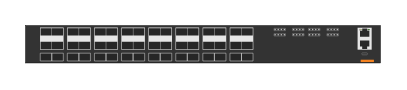

# JL624A Aruba 8325 32Y8C F2B (front)

## Definition

```
{
  _style: 'html=1;verticalLabelPosition=bottom;verticalAlign=top;outlineConnect=0;shadow=0;dashed=0;shape=mxgraph.rack.hpe_aruba.switches.jl624a_aruba_8325_32y8c_f2b_front;',
  _width: 142,
  _height: 15,
}
```

## Usage

```
import { Jl624aAruba832532y8cF2bFront } from '@reactiac/standard-components-diagrams/rackHpeArubaSwitches'

<Jl624aAruba832532y8cF2bFront/>
```

## Preview


