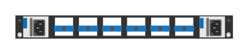

# JL625A Aruba 8325 32Y 8C B2F (rear)

## Definition

```
{
  _style: 'html=1;verticalLabelPosition=bottom;verticalAlign=top;outlineConnect=0;shadow=0;dashed=0;shape=mxgraph.rack.hpe_aruba.switches.jl625a_aruba_8325_32y_8c_b2f_rear;',
  _width: 142,
  _height: 15,
}
```

## Usage

```
import { Jl625aAruba832532y8cB2fRear } from '@reactiac/standard-components-diagrams/rackHpeArubaSwitches'

<Jl625aAruba832532y8cB2fRear/>
```

## Preview


