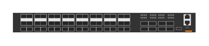

# JL626A Aruba 8325 32C F2B (front)

## Definition

```
{
  _style: { 
    entity: 'html=1;verticalLabelPosition=bottom;verticalAlign=top;outlineConnect=0;shadow=0;dashed=0;shape=mxgraph.rack.hpe_aruba.switches.jl626a_aruba_8325_32c_f2b_front;',
  },
  _original_width: 142,
  _original_height: 15,
}
```

## Usage

```
import { Jl626aAruba832532cF2bFront } from '@dinghy/standard-components-diagrams/rackHpeArubaSwitches'

<Jl626aAruba832532cF2bFront/>
```

## Preview


