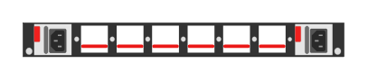

# JL626A Aruba 8325 32C F2B (rear)

## Definition

```
{
  _style: 'html=1;verticalLabelPosition=bottom;verticalAlign=top;outlineConnect=0;shadow=0;dashed=0;shape=mxgraph.rack.hpe_aruba.switches.jl626a_aruba_8325_32c_f2b_rear;',
  _width: 142,
  _height: 15,
}
```

## Usage

```
import { Jl626aAruba832532cF2bRear } from '@reactiac/standard-components-diagrams/rackHpeArubaSwitches'

<Jl626aAruba832532cF2bRear/>
```

## Preview


