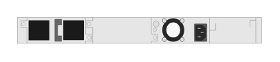

# JL660A Aruba 6300M 24-port HPE Smart Rate 1/2.5/5 GbE Class 6 PoE and 4-port switch (rear)

## Definition

```
{
  _style: { 
    entity: 'html=1;verticalLabelPosition=bottom;verticalAlign=top;outlineConnect=0;shadow=0;dashed=0;shape=mxgraph.rack.hpe_aruba.switches.jl660a_aruba_6300m_24_port_hpe_smart_rate_1_2_5_5_gbe_class_6_poe_and_4_port_switch_rear;',
  },
  _original_width: 142,
  _original_height: 15,
}
```

## Usage

```
import { Jl660aAruba6300m24PortHpeSmartRate1255GbeClass6PoeAnd4PortSwitchRear } from '@diac/standard-components-diagrams/rackHpeArubaSwitches'

<Jl660aAruba6300m24PortHpeSmartRate1255GbeClass6PoeAnd4PortSwitchRear/>
```

## Preview


