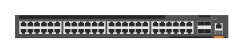

# JL663A Aruba 6300M 48-port 1GbE and 4-port SFP56 Switch

## Definition

```
{
  _style: 'html=1;verticalLabelPosition=bottom;verticalAlign=top;outlineConnect=0;shadow=0;dashed=0;shape=mxgraph.rack.hpe_aruba.switches.jl663a_aruba_6300m_48_port_1gbe_and_4_port_sfp56_switch;',
  _width: 142,
  _height: 15,
}
```

## Usage

```
import { Jl663aAruba6300m48Port1gbeAnd4PortSfp56Switch } from '@diac/standard-components-diagrams/rackHpeArubaSwitches'

<Jl663aAruba6300m48Port1gbeAnd4PortSfp56Switch/>
```

## Preview


