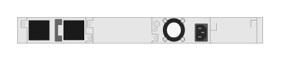

# JL664A Aruba 6300M 24-port 1GbE and 4-port SFP56 Switch (rear)

## Definition

```
{
  _style: { 
    entity: 'html=1;verticalLabelPosition=bottom;verticalAlign=top;outlineConnect=0;shadow=0;dashed=0;shape=mxgraph.rack.hpe_aruba.switches.jl664a_aruba_6300m_24_port_1gbe_and_4_port_sfp56_switch_rear;',
  },
  _width: 142,
  _height: 15,
}
```

## Usage

```
import { Jl664aAruba6300m24Port1gbeAnd4PortSfp56SwitchRear } from '@diac/standard-components-diagrams/rackHpeArubaSwitches'

<Jl664aAruba6300m24Port1gbeAnd4PortSfp56SwitchRear/>
```

## Preview


