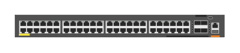

# JL727A Aruba 6200F 48-port 1GbE Class 4 PoE and 4-port SFP+ 370W Switch

## Definition

```
{
  _style: 'html=1;verticalLabelPosition=bottom;verticalAlign=top;outlineConnect=0;shadow=0;dashed=0;shape=mxgraph.rack.hpe_aruba.switches.jl727a_aruba_6200f_48_port_1gbe_class_4_poe_and_4_port_sfpplus_370w_switch;',
  _width: 142,
  _height: 15,
}
```

## Usage

```
import { Jl727aAruba6200f48Port1gbeClass4PoeAnd4PortSfp370wSwitch } from '@reactiac/standard-components-diagrams/rackHpeArubaSwitches'

<Jl727aAruba6200f48Port1gbeClass4PoeAnd4PortSfp370wSwitch/>
```

## Preview


