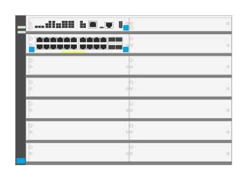

# JL9826A 5412R 92G PoE+ 4SFP zl2 Switch

## Definition

```
{
  _style: 'html=1;verticalLabelPosition=bottom;verticalAlign=top;outlineConnect=0;shadow=0;dashed=0;shape=mxgraph.rack.hpe_aruba.switches.jl9826a_5412r_92g_poeplus_4sfp_zl2_switch;',
  _width: 142,
  _height: 98,
}
```

## Usage

```
import { Jl9826a5412r92gPoe4sfpZl2Switch } from '@diac/standard-components-diagrams/rackHpeArubaSwitches'

<Jl9826a5412r92gPoe4sfpZl2Switch/>
```

## Preview


