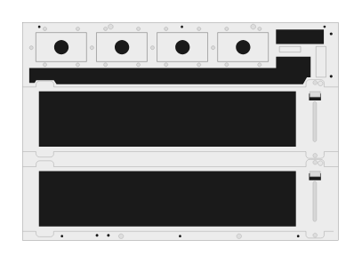

# R0X26A Aruba CX 6405 Switch (rear)

## Definition

```
{
  _style: { 
    entity: 'html=1;verticalLabelPosition=bottom;verticalAlign=top;outlineConnect=0;shadow=0;dashed=0;shape=mxgraph.rack.hpe_aruba.switches.r0x26a_aruba_cx_6405_switch_rear;',
  },
  _original_width: 142,
  _original_height: 98,
}
```

## Usage

```
import { R0x26aArubaCx6405SwitchRear } from '@diac/standard-components-diagrams/rackHpeArubaSwitches'

<R0x26aArubaCx6405SwitchRear/>
```

## Preview


