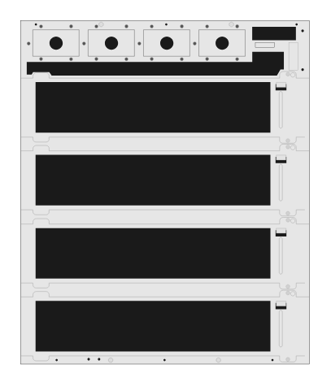

# R0X27A Aruba CX 6410 Switch (rear)

## Definition

```
{
  _style: 'html=1;verticalLabelPosition=bottom;verticalAlign=top;outlineConnect=0;shadow=0;dashed=0;shape=mxgraph.rack.hpe_aruba.switches.r0x27a_aruba_cx_6410_switch_rear;',
  _width: 142,
  _height: 169,
}
```

## Usage

```
import { R0x27aArubaCx6410SwitchRear } from '@reactiac/standard-components-diagrams/rackHpeArubaSwitches'

<R0x27aArubaCx6410SwitchRear/>
```

## Preview


