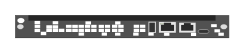

# R0X31A Aruba 6400 Management Module

## Definition

```
{
  _style: { 
    entity: 'html=1;verticalLabelPosition=bottom;verticalAlign=top;outlineConnect=0;shadow=0;dashed=0;shape=mxgraph.rack.hpe_aruba.switches.r0x31a_aruba_6400_management_module;',
  },
  _width: 142,
  _height: 15,
}
```

## Usage

```
import { R0x31aAruba6400ManagementModule } from '@diac/standard-components-diagrams/rackHpeArubaSwitches'

<R0x31aAruba6400ManagementModule/>
```

## Preview


