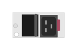

# R0X36A Aruba 6400 3000W PS w/C20

## Definition

```
{
  _style: { 
    entity: 'html=1;verticalLabelPosition=bottom;verticalAlign=top;outlineConnect=0;shadow=0;dashed=0;shape=mxgraph.rack.hpe_aruba.switches.r0x36a_aruba_6400_3000w_ps_w_c20;',
  },
  _width: 41,
  _height: 20,
}
```

## Usage

```
import { R0x36aAruba64003000wPsWC20 } from '@diac/standard-components-diagrams/rackHpeArubaSwitches'

<R0x36aAruba64003000wPsWC20/>
```

## Preview


