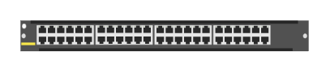

# R0X38A Aruba 6400-48p 1GbE CLS4 PoE Module

## Definition

```
{
  _style: { 
    entity: 'html=1;verticalLabelPosition=bottom;verticalAlign=top;outlineConnect=0;shadow=0;dashed=0;shape=mxgraph.rack.hpe_aruba.switches.r0x38a_aruba_6400_48p_1gbe_cls4_poe_module;',
  },
  _original_width: 142,
  _original_height: 15,
}
```

## Usage

```
import { R0x38aAruba640048p1gbeCls4PoeModule } from '@diac/standard-components-diagrams/rackHpeArubaSwitches'

<R0x38aAruba640048p1gbeCls4PoeModule/>
```

## Preview


