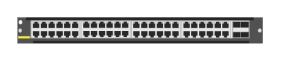

# R0X40A Aruba 6400-48p 1GbE CLS6 PoE 4SFP56 Module

## Definition

```
{
  _style: 'html=1;verticalLabelPosition=bottom;verticalAlign=top;outlineConnect=0;shadow=0;dashed=0;shape=mxgraph.rack.hpe_aruba.switches.r0x40a_aruba_6400_48p_1gbe_cls6_poe_4sfp56_module;',
  _width: 142,
  _height: 15,
}
```

## Usage

```
import { R0x40aAruba640048p1gbeCls6Poe4sfp56Module } from '@diac/standard-components-diagrams/rackHpeArubaSwitches'

<R0x40aAruba640048p1gbeCls6Poe4sfp56Module/>
```

## Preview


