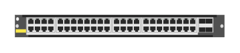

# R0X41A Aruba 6400-48p Smart Rate CSL6 PoE 4SFP56 Module

## Definition

```
{
  _style: { 
    entity: 'html=1;verticalLabelPosition=bottom;verticalAlign=top;outlineConnect=0;shadow=0;dashed=0;shape=mxgraph.rack.hpe_aruba.switches.r0x41a_aruba_6400_48p_smart_rate_cls6_poe_4sfp56_module;',
  },
  _original_width: 142,
  _original_height: 15,
}
```

## Usage

```
import { R0x41aAruba640048pSmartRateCsl6Poe4sfp56Module } from '@diac/standard-components-diagrams/rackHpeArubaSwitches'

<R0x41aAruba640048pSmartRateCsl6Poe4sfp56Module/>
```

## Preview


