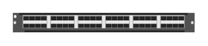

# R0X44 Aruba 6400-48p 10G/25G SFP28 Module

## Definition

```
{
  _style: { 
    entity: 'html=1;verticalLabelPosition=bottom;verticalAlign=top;outlineConnect=0;shadow=0;dashed=0;shape=mxgraph.rack.hpe_aruba.switches.r0x44_aruba_6400_48p_10g_25g_sfp28_module;',
  },
  _original_width: 142,
  _original_height: 15,
}
```

## Usage

```
import { R0x44Aruba640048p10g25gSfp28Module } from '@dinghy/standard-components-diagrams/rackHpeArubaSwitches'

<R0x44Aruba640048p10g25gSfp28Module/>
```

## Preview


