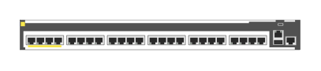

# ROM68A Aruba 2930M-24p PoE class 6 switch

## Definition

```
{
  _style: { 
    entity: 'html=1;verticalLabelPosition=bottom;verticalAlign=top;outlineConnect=0;shadow=0;dashed=0;shape=mxgraph.rack.hpe_aruba.switches.rom68a_aruba_2930m_24p_poe_class_6_switch;',
  },
  _width: 142,
  _height: 15,
}
```

## Usage

```
import { Rom68aAruba2930m24pPoeClass6Switch } from '@diac/standard-components-diagrams/rackHpeArubaSwitches'

<Rom68aAruba2930m24pPoeClass6Switch/>
```

## Preview


