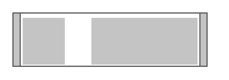

# IBM 3000VA UPS

## Definition

```
{
  _style: 'shape=mxgraph.rack.ibm.ibm_3000va_ups;html=1;labelPosition=right;align=left;spacingLeft=15;dashed=0;shadow=0;fillColor=#ffffff;',
  _width: 161,
  _height: 45,
}
```

## Usage

```
import { Ibm3000vaUps } from '@diac/standard-components-diagrams/rackIbm'

<Ibm3000vaUps/>
```

## Preview


