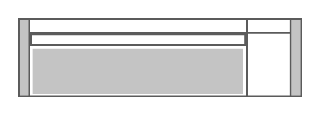

# IBM UPS5000 HV

## Definition

```
{
  _style: { 
    entity: 'shape=mxgraph.rack.ibm.ibm_ups5000_hv;html=1;labelPosition=right;align=left;spacingLeft=15;dashed=0;shadow=0;fillColor=#ffffff;',
  },
  _original_width: 161,
  _original_height: 45,
}
```

## Usage

```
import { IbmUps5000Hv } from '@dinghy/standard-components-diagrams/rackIbm'

<IbmUps5000Hv/>
```

## Preview


