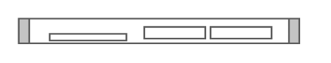

# IBM x3250 M4

## Definition

```
{
  _style: { 
    entity: 'shape=mxgraph.rack.ibm.ibm_x3250_m4;html=1;labelPosition=right;align=left;spacingLeft=15;dashed=0;shadow=0;fillColor=#ffffff;',
  },
  _width: 161,
  _height: 15,
}
```

## Usage

```
import { IbmX3250M4 } from '@diac/standard-components-diagrams/rackIbm'

<IbmX3250M4/>
```

## Preview


