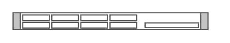

# IBM x3550 M4

## Definition

```
{
  _style: { 
    entity: 'shape=mxgraph.rack.ibm.ibm_x3550_m4;html=1;labelPosition=right;align=left;spacingLeft=15;dashed=0;shadow=0;fillColor=#ffffff;',
  },
  _original_width: 161,
  _original_height: 15,
}
```

## Usage

```
import { IbmX3550M4 } from '@dinghy/standard-components-diagrams/rackIbm'

<IbmX3550M4/>
```

## Preview


