# Rack IBM Entities

- [Ibm11000vaUps](./ibm-11000va-ups.md)  
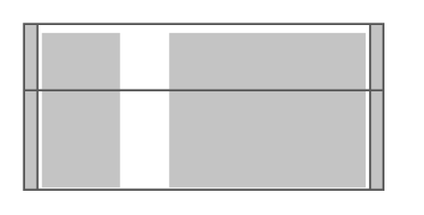

- [Ibm15002200vaUps](./ibm-1500-2200va-ups.md)  
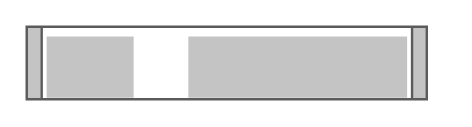

- [Ibm1754LocalConsoleManager](./ibm-1754-local-console-manager.md)  

- [Ibm1uFlatPanelConsoleKit](./ibm-1u-flat-panel-console-kit.md)  
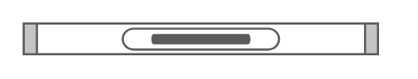

- [Ibm3000vaUps](./ibm-3000va-ups.md)  

- [Ibm6000vaUps](./ibm-6000va-ups.md)  
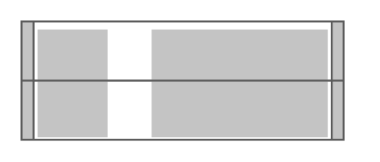

- [IbmDx360](./ibm-dx360.md)  
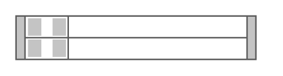

- [IbmUps10000](./ibm-ups10000.md)  
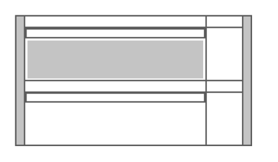

- [IbmUps5000Hv](./ibm-ups5000-hv.md)  

- [IbmUps7500](./ibm-ups7500.md)  

- [IbmX3250M4](./ibm-x3250-m4.md)  

- [IbmX3530M4](./ibm-x3530-m4.md)  
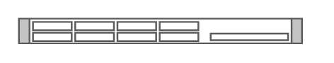

- [IbmX3550M4](./ibm-x3550-m4.md)  

- [IbmX3630M3](./ibm-x3630-m3.md)  

- [IbmX3630M4](./ibm-x3630-m4.md)  
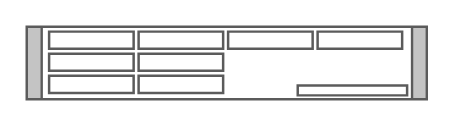

- [IbmX3650M4](./ibm-x3650-m4.md)  

- [IbmX3690](./ibm-x3690.md)  
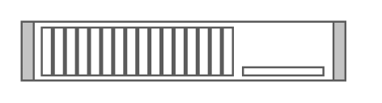

- [IbmX3750](./ibm-x3750.md)  

- [IbmX3755M3](./ibm-x3755-m3.md)  
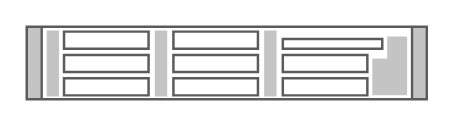

- [IbmX3850X5](./ibm-x3850-x5.md)  
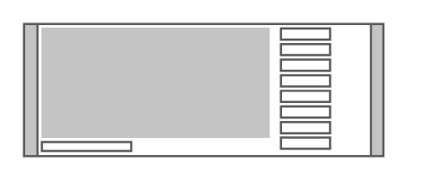

- [IbmX3950X5](./ibm-x3950-x5.md)  

