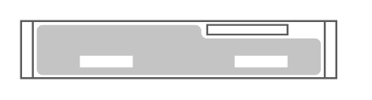

# Netra Server X3-2

## Definition

```
{
  _style: 'shape=mxgraph.rack.oracle.netra_server_x3-2;html=1;labelPosition=right;align=left;spacingLeft=15;dashed=0;shadow=0;fillColor=#ffffff;',
  _width: 161,
  _height: 30,
}
```

## Usage

```
import { NetraServerX32 } from '@reactiac/standard-components-diagrams/rackOracle'

<NetraServerX32/>
```

## Preview


