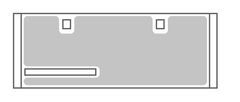

# Netra Sparc T4-2 Server

## Definition

```
{
  _style: { 
    entity: 'shape=mxgraph.rack.oracle.netra_sparc_t4-2_server;html=1;labelPosition=right;align=left;spacingLeft=15;dashed=0;shadow=0;fillColor=#ffffff;',
  },
  _width: 161,
  _height: 60,
}
```

## Usage

```
import { NetraSparcT42Server } from '@diac/standard-components-diagrams/rackOracle'

<NetraSparcT42Server/>
```

## Preview


