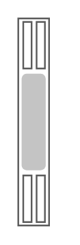

# Netra X6270 Server Module

## Definition

```
{
  _style: { 
    entity: 'shape=mxgraph.rack.oracle.netra_x6270_server_module;html=1;labelPosition=right;align=left;spacingLeft=15;dashed=0;shadow=0;fillColor=#ffffff;',
  },
  _width: 19,
  _height: 121,
}
```

## Usage

```
import { NetraX6270ServerModule } from '@diac/standard-components-diagrams/rackOracle'

<NetraX6270ServerModule/>
```

## Preview


