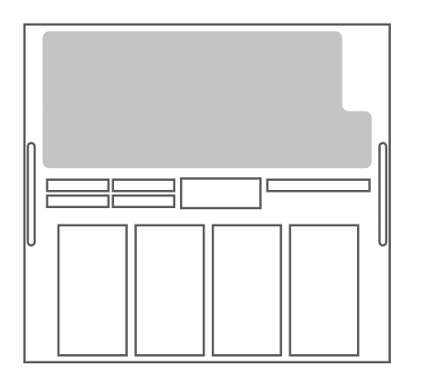

# Sparc Enterprise M5000 Server

## Definition

```
{
  _style: { 
    entity: 'shape=mxgraph.rack.oracle.sparc_enterprise_m5000_server;html=1;labelPosition=right;align=left;spacingLeft=15;dashed=0;shadow=0;fillColor=#ffffff;',
  },
  _original_width: 161,
  _original_height: 149,
}
```

## Usage

```
import { SparcEnterpriseM5000Server } from '@dinghy/standard-components-diagrams/rackOracle'

<SparcEnterpriseM5000Server/>
```

## Preview


