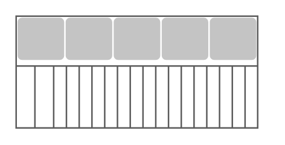

# Sparc T4-4 Server

## Definition

```
{
  _style: 'shape=mxgraph.rack.oracle.sparc_t4-4_server;html=1;labelPosition=right;align=left;spacingLeft=15;dashed=0;shadow=0;fillColor=#ffffff;',
  _width: 161,
  _height: 75,
}
```

## Usage

```
import { SparcT44Server } from '@diac/standard-components-diagrams/rackOracle'

<SparcT44Server/>
```

## Preview


