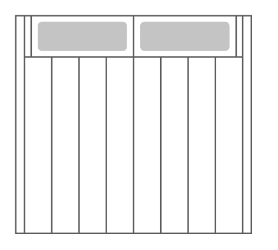

# Sun Blade 6000 Enclosure

## Definition

```
{
  _style: 'shape=mxgraph.rack.oracle.sun_blade_6000_enclosure;html=1;labelPosition=right;align=left;spacingLeft=15;dashed=0;shadow=0;fillColor=#ffffff;',
  _width: 161,
  _height: 149,
}
```

## Usage

```
import { SunBlade6000Enclosure } from '@diac/standard-components-diagrams/rackOracle'

<SunBlade6000Enclosure/>
```

## Preview


