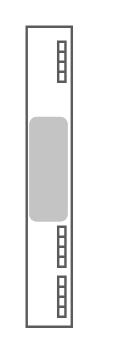

# Sun Blade 6000 Virtualized 40 GbE Network Express Module

## Definition

```
{
  _style: { 
    entity: 'shape=mxgraph.rack.oracle.sun_blade_6000_virtualized_40_gbe_network_express_module;html=1;labelPosition=right;align=left;spacingLeft=15;dashed=0;shadow=0;fillColor=#ffffff;',
  },
  _original_width: 19,
  _original_height: 121,
}
```

## Usage

```
import { SunBlade6000Virtualized40GbeNetworkExpressModule } from '@dinghy/standard-components-diagrams/rackOracle'

<SunBlade6000Virtualized40GbeNetworkExpressModule/>
```

## Preview


