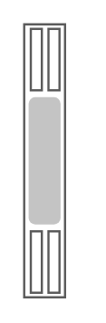

# Sun Blade X6270 M2 Server Module

## Definition

```
{
  _style: 'shape=mxgraph.rack.oracle.sun_blade_x6270_m2_server_module;html=1;labelPosition=right;align=left;spacingLeft=15;dashed=0;shadow=0;fillColor=#ffffff;',
  _width: 19,
  _height: 121,
}
```

## Usage

```
import { SunBladeX6270M2ServerModule } from '@diac/standard-components-diagrams/rackOracle'

<SunBladeX6270M2ServerModule/>
```

## Preview


