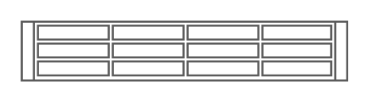

# Sun Storage 2500-M2 Array

## Definition

```
{
  _style: { 
    entity: 'shape=mxgraph.rack.oracle.sun_storage_2500-m2_array;html=1;labelPosition=right;align=left;spacingLeft=15;dashed=0;shadow=0;fillColor=#ffffff;',
  },
  _original_width: 161,
  _original_height: 30,
}
```

## Usage

```
import { SunStorage2500M2Array } from '@dinghy/standard-components-diagrams/rackOracle'

<SunStorage2500M2Array/>
```

## Preview


