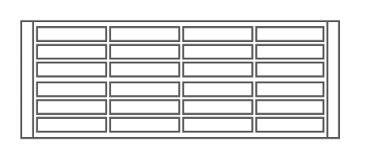

# Sun ZFS Storage 7320

## Definition

```
{
  _style: 'shape=mxgraph.rack.oracle.sun_zfs_storage_7320;html=1;labelPosition=right;align=left;spacingLeft=15;dashed=0;shadow=0;fillColor=#ffffff;',
  _width: 161,
  _height: 60,
}
```

## Usage

```
import { SunZfsStorage7320 } from '@diac/standard-components-diagrams/rackOracle'

<SunZfsStorage7320/>
```

## Preview


