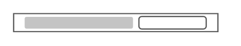

# SunFire X4100

## Definition

```
{
  _style: 'shape=mxgraph.rack.oracle.sunfire_x4100;html=1;labelPosition=right;align=left;spacingLeft=15;dashed=0;shadow=0;fillColor=#ffffff;',
  _width: 161,
  _height: 15,
}
```

## Usage

```
import { SunfireX4100 } from '@reactiac/standard-components-diagrams/rackOracle'

<SunfireX4100/>
```

## Preview


