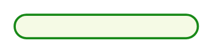

# Authenticate

## Definition

```
{
  _style: { 
    entity: 'rounded=1;whiteSpace=wrap;html=1;arcSize=50;strokeColor=#188918;fillColor=#f5fae5;fontColor=#266f3a;strokeWidth=1.5;',
  },
  _original_width: 125,
  _original_height: 16,
}
```

## Usage

```
import { Authenticate } from '@dinghy/standard-components-diagrams/sapAnnotationsAndInterfaces'

<Authenticate/>
```

## Preview


