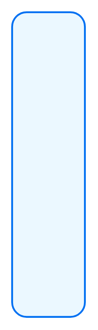

# Bigger SAP Box with multiple layers

## Definition

```
{
  _style: 'rounded=1;whiteSpace=wrap;html=1;strokeColor=#0070F2;fillColor=#EBF8FF;arcSize=24;absoluteArcSize=1;imageWidth=64;imageHeight=64;strokeWidth=1.5;',
  _width: 0,
  _height: 250,
}
```

## Usage

```
import { BiggerSapBoxWithMultipleLayers } from '@reactiac/standard-components-diagrams/sapComponents'

<BiggerSapBoxWithMultipleLayers/>
```

## Preview


