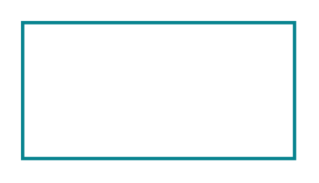

# Accent 1 3

## Definition

```
{
  _style: { 
    entity: 'endArrow=none;html=1;strokeColor=#07838F;bendable=1;rounded=0;endFill=0;endSize=4;strokeWidth=1.5;startSize=4;startArrow=none;startFill=0;',
  },
  _original_width: 120,
  _original_height: 0,
}
```

## Usage

```
import { Accent13 } from '@dinghy/standard-components-diagrams/sapConnectors'

<Accent13/>
```

## Preview


