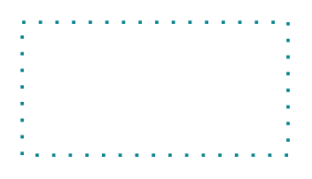

# Accent 1, Dotted

## Definition

```
{
  _style: { 
    entity: 'endArrow=blockThin;html=1;strokeColor=#07838F;bendable=1;rounded=0;endFill=1;endSize=4;edgeStyle=entityRelationEdgeStyle;startArrow=none;startFill=0;startSize=4;jumpStyle=none;jumpSize=0;targetPerimeterSpacing=15;dashed=1;strokeWidth=1.5;dashPattern=1 4;',
  },
  _width: 120,
  _height: 0,
}
```

## Usage

```
import { Accent1Dotted } from '@diac/standard-components-diagrams/sapConnectors'

<Accent1Dotted/>
```

## Preview


