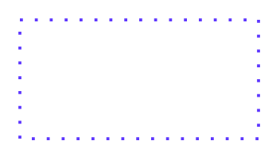

# Accent 2, Dotted 3

## Definition

```
{
  _style: 'endArrow=none;html=1;strokeColor=#5D36FF;bendable=1;rounded=0;endFill=0;endSize=4;edgeStyle=entityRelationEdgeStyle;startArrow=none;startFill=0;startSize=4;jumpStyle=none;jumpSize=0;targetPerimeterSpacing=15;dashed=1;strokeWidth=1.5;dashPattern=1 4;',
  _width: 120,
  _height: 0,
}
```

## Usage

```
import { Accent2Dotted3 } from '@diac/standard-components-diagrams/sapConnectors'

<Accent2Dotted3/>
```

## Preview


