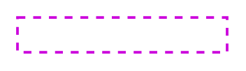

# Accent 3, Dashed 4

## Definition

```
{
  _style: 'edgeStyle=orthogonalEdgeStyle;rounded=0;orthogonalLoop=1;jettySize=auto;html=1;fontSize=18;strokeColor=#CB00DC;fontFamily=Helvetica;fontColor=default;targetPerimeterSpacing=15;endSize=4;startSize=4;dashed=1;endArrow=blockThin;endFill=1;strokeWidth=1.5;startArrow=none;startFill=0;',
  _width: 120,
  _height: 20,
}
```

## Usage

```
import { Accent3Dashed4 } from '@reactiac/standard-components-diagrams/sapConnectors'

<Accent3Dashed4/>
```

## Preview


