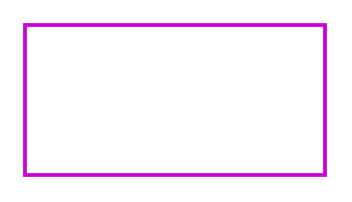

# Accent 3

## Definition

```
{
  _style: 'endArrow=blockThin;html=1;strokeColor=#CB00DC;bendable=1;rounded=0;endFill=1;endSize=4;strokeWidth=1.5;startSize=4;startArrow=none;startFill=0;',
  _width: 120,
  _height: 0,
}
```

## Usage

```
import { Accent3 } from '@reactiac/standard-components-diagrams/sapConnectors'

<Accent3/>
```

## Preview


