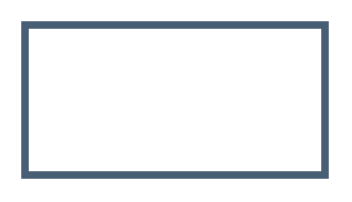

# Default, Firewall

## Definition

```
{
  _style: 'endArrow=none;html=1;strokeColor=#475E75;bendable=1;rounded=0;endFill=0;endSize=3;strokeWidth=3;',
  _width: 120,
  _height: 0,
}
```

## Usage

```
import { DefaultFirewall } from '@reactiac/standard-components-diagrams/sapConnectors'

<DefaultFirewall/>
```

## Preview


