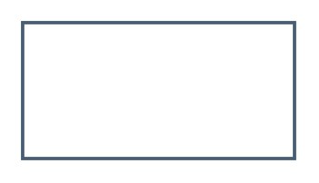

# Direct, Bi-directional

## Definition

```
{
  _style: { 
    entity: 'endArrow=blockThin;html=1;strokeColor=#475E75;bendable=1;rounded=0;endFill=1;endSize=4;edgeStyle=entityRelationEdgeStyle;startArrow=blockThin;startFill=1;startSize=4;jumpStyle=none;jumpSize=0;targetPerimeterSpacing=15;strokeWidth=1.5;',
  },
  _original_width: 120,
  _original_height: 0,
}
```

## Usage

```
import { DirectBiDirectional } from '@dinghy/standard-components-diagrams/sapConnectors'

<DirectBiDirectional/>
```

## Preview


