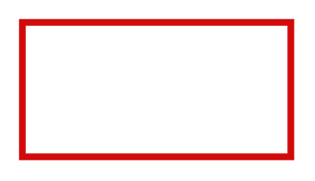

# Firewall 2

## Definition

```
{
  _style: { 
    entity: 'endArrow=none;html=1;strokeColor=#D20A0A;bendable=1;rounded=0;endFill=0;endSize=6;strokeWidth=3;',
  },
  _width: 120,
  _height: 0,
}
```

## Usage

```
import { Firewall2 } from '@diac/standard-components-diagrams/sapConnectors'

<Firewall2/>
```

## Preview


