# Sap Connectors Entities

- [Accent1](./accent-1.md)  
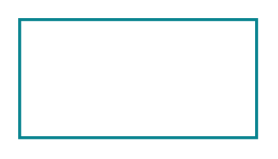

- [Accent12](./accent-1-2.md)  

- [Accent13](./accent-1-3.md)  

- [Accent14](./accent-1-4.md)  

- [Accent1Dashed](./accent-1-dashed.md)  

- [Accent1Dashed2](./accent-1-dashed-2.md)  

- [Accent1Dashed3](./accent-1-dashed-3.md)  

- [Accent1Dashed4](./accent-1-dashed-4.md)  

- [Accent1Dotted](./accent-1-dotted.md)  

- [Accent1Dotted2](./accent-1-dotted-2.md)  

- [Accent1Dotted3](./accent-1-dotted-3.md)  

- [Accent1Dotted4](./accent-1-dotted-4.md)  

- [Accent2](./accent-2.md)  

- [Accent22](./accent-2-2.md)  
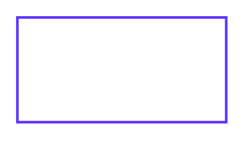

- [Accent23](./accent-2-3.md)  

- [Accent24](./accent-2-4.md)  

- [Accent2Dashed](./accent-2-dashed.md)  

- [Accent2Dashed2](./accent-2-dashed-2.md)  
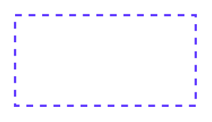

- [Accent2Dashed3](./accent-2-dashed-3.md)  

- [Accent2Dashed4](./accent-2-dashed-4.md)  

- [Accent2Dotted](./accent-2-dotted.md)  

- [Accent2Dotted2](./accent-2-dotted-2.md)  
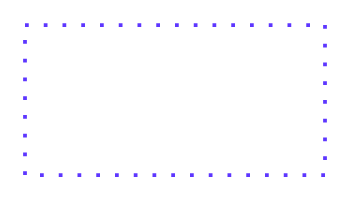

- [Accent2Dotted3](./accent-2-dotted-3.md)  

- [Accent2Dotted4](./accent-2-dotted-4.md)  

- [Accent3](./accent-3.md)  

- [Accent32](./accent-3-2.md)  
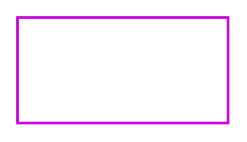

- [Accent33](./accent-3-3.md)  

- [Accent34](./accent-3-4.md)  

- [Accent3Dashed](./accent-3-dashed.md)  

- [Accent3Dashed2](./accent-3-dashed-2.md)  

- [Accent3Dashed3](./accent-3-dashed-3.md)  

- [Accent3Dashed4](./accent-3-dashed-4.md)  

- [Accent3Dotted](./accent-3-dotted.md)  

- [Accent3Dotted2](./accent-3-dotted-2.md)  

- [Accent3Dotted3](./accent-3-dotted-3.md)  
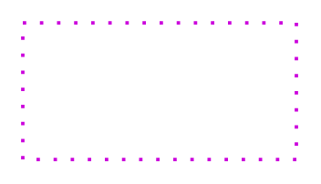

- [Accent3Dotted4](./accent-3-dotted-4.md)  
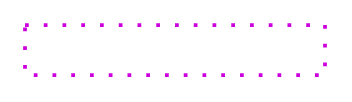

- [DefaultFirewall](./default-firewall.md)  

- [DirectBiDirectional](./direct-bi-directional.md)  

- [DirectElbow](./direct-elbow.md)  

- [DirectOneDirectional](./direct-one-directional.md)  

- [Error](./error.md)  

- [Error2](./error-2.md)  

- [Error3](./error-3.md)  

- [Error4](./error-4.md)  

- [ErrorDashed](./error-dashed.md)  

- [ErrorDashed2](./error-dashed-2.md)  
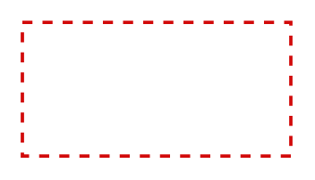

- [ErrorDashed3](./error-dashed-3.md)  

- [ErrorDashed4](./error-dashed-4.md)  

- [ErrorDotted](./error-dotted.md)  
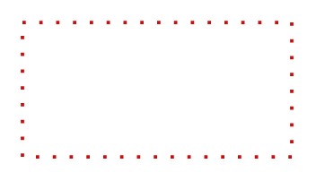

- [ErrorDotted2](./error-dotted-2.md)  

- [ErrorDotted3](./error-dotted-3.md)  

- [ErrorDotted4](./error-dotted-4.md)  
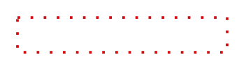

- [Firewall2](./firewall-2.md)  

- [Firewall3](./firewall-3.md)  

- [IndirectBiDirectional](./indirect-bi-directional.md)  
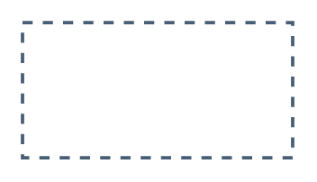

- [IndirectElbow](./indirect-elbow.md)  

- [IndirectOneDirectional](./indirect-one-directional.md)  

- [OptionalBiDirectional](./optional-bi-directional.md)  

- [OptionalElbow](./optional-elbow.md)  

- [OptionalOneDirectional](./optional-one-directional.md)  

- [PlainOptional](./plain-optional.md)  

- [PlainDirect](./plain-direct.md)  

- [PlainIndirect](./plain-indirect.md)  

- [Success](./success.md)  

- [Success2](./success-2.md)  

- [Success3](./success-3.md)  

- [Success4](./success-4.md)  

- [SuccessDashed](./success-dashed.md)  

- [SuccessDashed2](./success-dashed-2.md)  

- [SuccessDashed3](./success-dashed-3.md)  

- [SuccessDashed4](./success-dashed-4.md)  

- [SuccessDotted](./success-dotted.md)  
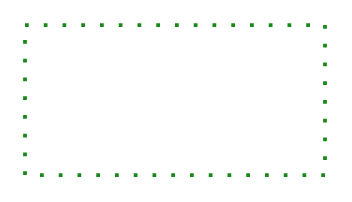

- [SuccessDotted2](./success-dotted-2.md)  

- [SuccessDotted3](./success-dotted-3.md)  

- [SuccessDotted4](./success-dotted-4.md)  

- [Warning](./warning.md)  

- [Warning2](./warning-2.md)  

- [Warning3](./warning-3.md)  

- [Warning4](./warning-4.md)  

- [WarningDashed](./warning-dashed.md)  
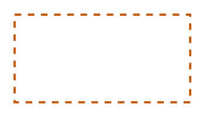

- [WarningDashed2](./warning-dashed-2.md)  

- [WarningDashed3](./warning-dashed-3.md)  

- [WarningDashed4](./warning-dashed-4.md)  

- [WarningDotted](./warning-dotted.md)  

- [WarningDotted2](./warning-dotted-2.md)  
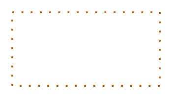

- [WarningDotted3](./warning-dotted-3.md)  

- [WarningDotted4](./warning-dotted-4.md)  

