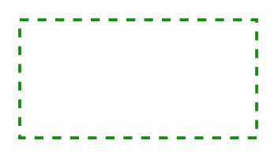

# Success, Dashed 2

## Definition

```
{
  _style: { 
    entity: 'endArrow=none;html=1;strokeColor=#188918;bendable=1;rounded=0;endFill=0;endSize=4;edgeStyle=entityRelationEdgeStyle;startArrow=none;startFill=0;startSize=4;jumpStyle=none;jumpSize=0;targetPerimeterSpacing=15;dashed=1;strokeWidth=1.5;',
  },
  _original_width: 120,
  _original_height: 0,
}
```

## Usage

```
import { SuccessDashed2 } from '@dinghy/standard-components-diagrams/sapConnectors'

<SuccessDashed2/>
```

## Preview


