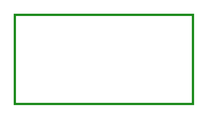

# Success

## Definition

```
{
  _style: { 
    entity: 'endArrow=blockThin;html=1;strokeColor=#188918;bendable=1;rounded=0;endFill=1;endSize=4;strokeWidth=1.5;startSize=4;startArrow=none;startFill=0;',
  },
  _original_width: 120,
  _original_height: 0,
}
```

## Usage

```
import { Success } from '@diac/standard-components-diagrams/sapConnectors'

<Success/>
```

## Preview


