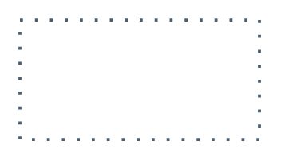

# Optional one-directional

## Definition

```
{
  _style: 'endArrow=blockThin;html=1;strokeColor=#475E75;bendable=1;rounded=0;endFill=1;endSize=4;edgeStyle=entityRelationEdgeStyle;startArrow=none;startFill=0;startSize=4;jumpStyle=none;jumpSize=0;targetPerimeterSpacing=15;dashed=1;strokeWidth=1.5;dashPattern=1 4;',
  _width: 120,
  _height: 0,
}
```

## Usage

```
import { OptionalOneDirectional } from '@reactiac/standard-components-diagrams/sapDefaultConnectors'

<OptionalOneDirectional/>
```

## Preview


