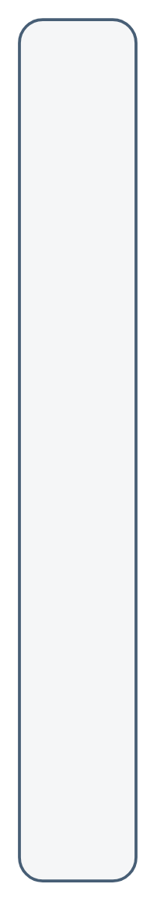

# 3rd Party Layer

## Definition

```
{
  _style: { 
    entity: 'rounded=1;whiteSpace=wrap;html=1;strokeColor=#475E75;fillColor=#F5F6F7;arcSize=24;absoluteArcSize=1;imageWidth=64;imageHeight=64;strokeWidth=1.5;verticalAlign=top;align=left;fontSize=16;fontStyle=1;spacingTop=10;spacingLeft=20;',
  },
  _original_width: 0,
  _original_height: 440,
}
```

## Usage

```
import { Component3rdPartyLayer } from '@dinghy/standard-components-diagrams/sapEssentials'

<Component3rdPartyLayer/>
```

## Preview


