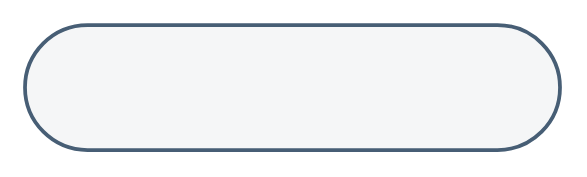

# HTTPS Protocol

## Definition

```
{
  _style: 'rounded=1;whiteSpace=wrap;html=1;arcSize=50;strokeColor=#475E75;fillColor=#F5F6F7;strokeWidth=1.5;fontColor=#475E75;fontStyle=1;fontSize=10;',
  _width: 214,
  _height: 50,
}
```

## Usage

```
import { HttpsProtocol } from '@diac/standard-components-diagrams/sapEssentials'

<HttpsProtocol/>
```

## Preview


